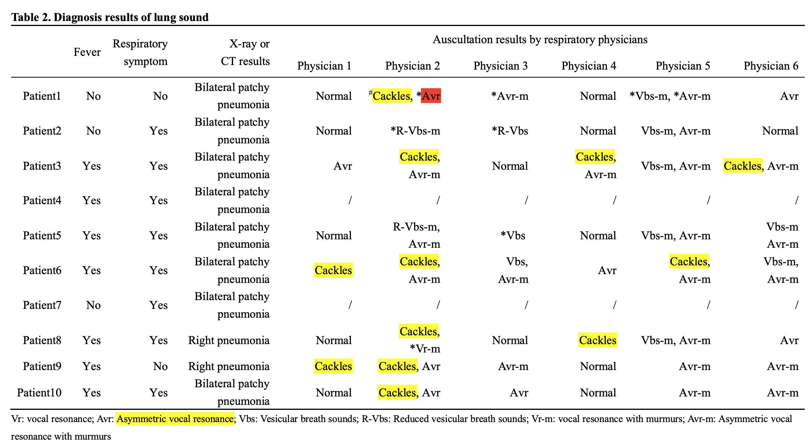

# The Time and Frequency Features of COVID-19 Respiratory Sounds
##### by BW, June 04, 2020
###### Paper reference: The respiratory sound features of COVID-19 patients fill gaps between clinical data and screening methods. April 10, 2020. (https://www.medrxiv.org/content/10.1101/2020.04.07.20051060v1)
---
## 1. [Respiratory Sound Characteristics](https://www.ncbi.nlm.nih.gov/pmc/articles/PMC6101681/)
It is commonly admitted that respiratory sound frequencies are in the range of `50-2,500 Hz (BW:sr=44100Hz)`, and tracheal sounds can reach up to 4,000 Hz. This means we can define a sampling frequency at 8 kHz. `The spectrum of cardiac sounds falls between 20 and 100Hz (BW: so the minimum RS is 100Hz)` for basic signals and higher frequency (over 500 Hz) for breaths. Abnormal sounds can be divided into two sub-classes: – Continuous or stationary sounds, e.g., wheezes, rhonchus.; – Discontinuous or non-stationary sounds, e.g., fine or coarse crackles. Other adventitious sounds include squawk, snoring, and stridor. Below, it outlines the characteristics of the `two most extensively studied noises: wheezes and crackles`.

Various sounds can be heard depending on where the stethoscope is positioned. **Most of the energy is below 1,000 Hz for the signals captured over the chest**. This increases to up to 2,000 Hz in the `mouth` and 5,000 Hz over the `trachea`, with a drop at 800 Hz.

+ Wheeze	>80ms	BI and mostly BO	>400 Hz	Asthma, COPD, foreign body
+ Fine crackle	~5ms	BI	650 Hz	Pneumonia, congestive heart failure, lung fibrosis
+ Coarse crackle	~15ms	Mostly BI, BO, both	350 Hz	Chronic bronchitis, bronchiectasis, COPD
+ (*TBD*) `Crackles` have been defined as lasting for **less than 20ms** and ranging between `100 and 200 Hz` in frequency.

1. Crackles: These explosive and discontinuous adventitious sounds generally appear during inspiration. They are characterized by their specific waveform, duration and location in the respiratory cycle. A crackle can be characterized as fine (short duration) or coarse (long duration). Crackles usually indicate that there is a pathological process in the pulmonary tissue or airways. “Coarse” crackles occurring during the beginning of inhalation indicate a chronic bronchial disease. When occurring in the middle of inhalation they indicate bronchiectasis and when at the end of inhalation, they are generated by the peripheral bronchi and could be a sign of pneumonia. “Fine” crackles are generated by the peripheral bronchi. They are symptoms of infection or pulmonary edema. “Coarse” crackles sound like salt poured into a hot pan, while “fine” crackles sound more like Velcro strips being slowly pulled apart or a bottle of sparkling water being opened.

2. Wheeze: This is a continuous adventitious musical sound. Acoustically, it is characterized by periodic waveforms with a dominant frequency usually over 100 Hz and lasting over 100ms, thus always including at least 10 successive vibrations. Wheezes are usually associated with an airway obstruction resulted from various causes. If the wheeze essentially contains a single frequency, it is classed as monophonic; polyphonic wheezes contain several frequencies. A wheeze can be located at the site of an anatomic obstruction or can be diffused in cases of asthma. Shaharum et al. [12] recommend placing the stethoscope over the trachea to determine its type and avoid listening to the signal across the chest, which acts as a low-pass filter, thus preserving more signal bandwidth.

3. Cardiac sounds can cause interference during lung sound analysis. The spectrum of heart sounds is 20-100 Hz. According to Elphick et al., cardiac sounds can be attenuated using a simple band-pass filter [50-2, 500 Hz]. However, this filter must not be a high-pass filter (100 Hz) as the main components of lung sounds are also located in this frequency range. Consequently, several methods have been tested: wavelets, adaptive filtering with a recursive least squares algorithm, time/frequency filtering, reconstruction, autoregressive/mobile average estimation (AR/MA) in time/frequency domain of wavelet coefficients, independent component analysis and the entropy-based method.

## 2. Respiratory Sound Features of COVID-19 Infected Patients
### 2.1 Common Abnormal Breath Sounds
This includes bronchial breathing (common in pneumonia or fibrosis), stridor (indicating upper-airway obstruction), wheeze (typical signs of asthma), rhonchus (common with airway narrowing caused by bronchitis, chronic obstructive pulmonary disease), cackles (including fine cackles and coarse, can be earliest sign of disease, eg. interstitial lung fibrosis, congestive heart failure, pneumonia, asbestosis, etc.), pleural friction rub (associated with pleural related disease), squawk (associated with conditions affecting distal airways)

### 2.2 The Most Common Abnormal Breath Sounds of COVID-19
Crackles, asymmetrical vocal resonance (`BW: wheezes?`) and indistinguishable murmurs are the most common abnormal breath sounds.

The diagnosis results of respiratory sounds in the asymptomatic patients included crackles, asymmetric vocal resonance, and abnormal vesicular breath sounds with murmurs.

## 3. The Time and Frequency Features of COVID-19 Respiratory Sounds

+ [x] Concerning **crackles features**: `duration <100ms, and the main frequency range is about 200-600Hz`.
+ [x] The waveform in the cited paper shows a sharp peak in high intensity range, and the interval time are about `50ms`. The **main frequencies** are between `150 and 600Hz`. (*Crackles: Crackles are short, explosive, nonmusical sounds heard on inspiration and sometimes during expiration. The feature is `duration<100ms`, frequency range is about `350Hz (Fine cackles) , or 650Hz (Coarse cackles)`, other studies have reported the rang is `100-1000 Hz`.)*
+ [x] BW: **Most of the energy is below 1,000 Hz for the signals captured over the chest**. This increases to up to 2,000 Hz in the `mouth` and 5,000 Hz over the `trachea`, with a drop at 800 Hz.
+ [x] (*TBD*) Wheeze	>80ms	BI and mostly BO	>400 Hz	Asthma, COPD, foreign body
+ [x] (*TBD*) Fine crackle	~5ms	BI	650 Hz	Pneumonia, congestive heart failure, lung fibrosis
+ [x] (*TBD*) Coarse crackle	~15ms	Mostly BI, BO, both	350 Hz	Chronic bronchitis, bronchiectasis, COPD
+ [x] (*TBD*) `Crackles` have been defined as lasting for **less than 20ms** and ranging between `100 and 200 Hz` in frequency.

  
  
  

_From left to right: normal rs, crackle, and wheeze._
